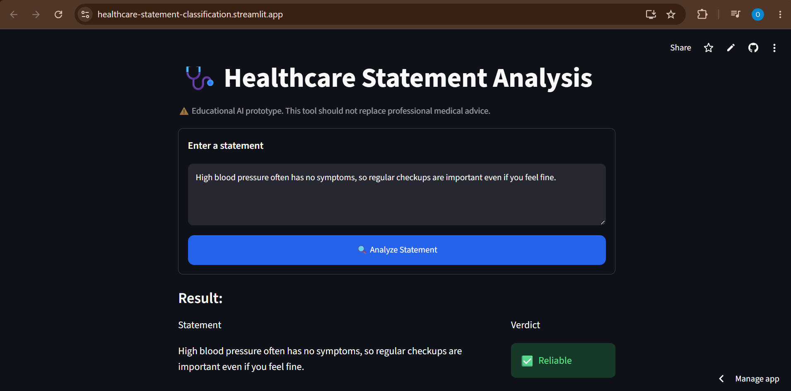
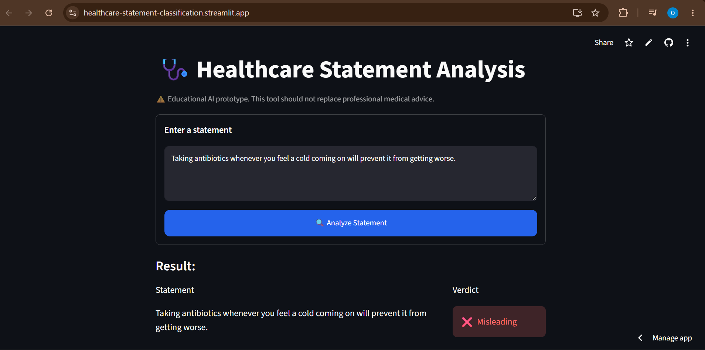

## 🩺 Healthcare Statement Classification with NLP & Machine Learning
This is a prototype that uses **Natural Language Processing** (NLP) feature extraction and **Machine learning** (ML) to analyze health related statements and predict whether they are **Reliable**  ✅ or **Misleading** ❌

The application is deployed using Streamlit and powered by a Logistic Regression classifier trained on TF-IDF text features.

TF-IDF: Term Fequency-Inverse Document Frequency


## ✨ Features

- 📋 Healthcare statement classification
- 🤖 Model- Trained a Logistic Regression model using TF-IDF text features for accurate classification
- 💻 Web Interface- Interactive Streamlit web application
- ⚡ Instant predictions

## 🛠️ Tech Stack

| Component | Technology |
|-----------|------------|
| 💻 Programming Language | Python |
| 🌐 Web Application Interface | Streamlit |
| 🧠 Machine Learning Library | Scikit-learn |
| 📝 NLP Technique | TF-IDF Vectorization |

## 📂 Project Structure

```
Healthcare-Statement-Classification/
│
├── images/
│   ├── reliable_classification.png
│   ├── misleading_classification.png
│   └── workflow.png
│
├── models/
│   ├── healthcare_lr_model.pkl
│   └── tfidf_vectorizer.pkl
│
├── Healthcare_Statements_Classification.ipynb
├── README.md
├── app.py
├── healthcare_statements.csv
├── predicted_examples.csv
└── requirements.txt
```

## 🚀 Installation Steps
Clone this repo:
```bash
git clone https://github.com/Ibitoye07/Healthcare-Statement-Classification.git
```
Move into the project directory:

```bash
cd Healthcare-Statement-Classification
```
Install dependencies:

```bash
pip install -r requirements.txt
```
## ▶️ Running the App
### Run locally:
```bash
streamlit run app.py
```

### Live Demo

🌐 **Try the deployed application here:**

https://healthcare-statement-classification.streamlit.app/

## 🌐 Usage
1. Copy the link to your browser
2. Type a sentence like:

   ```"Regular blood pressure checks help detect hypertension early"```

   or


   ```"Eating only ginger and lemon can cure typhoid fever"``` 

4. Hit Analyze and watch the magic happen ✨

   You'll see the verdict !

## 🖼️ Example Screnshots
### ✅ Reliable Statement




### ❌ Misleading Statement




## 🔮 Future Improvements

- 📈 Expand the dataset to include more health-related statements to improve the model's performance and generalization.
- 🤖 Explore transformer-based NLP models such as BERT for improved text classification.
- 🌍 Support local Nigerian languages.
- 📊 Display prediction confidence scores.
- 💡 Integrate explainable AI techniques (e.g., SHAP or LIME) to explain why a statement was classified as Reliable or Misleading.

## 📜 License

This project is licensed under the [MIT License](LICENSE)

## 💬 Contributing
Contributions are welcome. If you find a bug or have a suggestion for improving the project 

please [open an issue](https://github.com/YOUR_USERNAME/Healthcare-Statement-Classification/issues) or submit a pull request.

## ⚠️ Disclaimer

This project is a proof-of-concept machine learning prototype developed for educational and research purposes. While the model aims to classify healthcare statements as **Reliable** or **Misleading**, its predictions are based on a limited labelled dataset and should not be relied upon for medical, clinical, or public health decision-making.

Users should verify health information using reputable medical sources and consult qualified healthcare professionals for medical advice, diagnosis, or treatment.


Created with ☕ and 💻 by **[Olaniran Ibitoye](https://github.com/Ibitoye07)**
